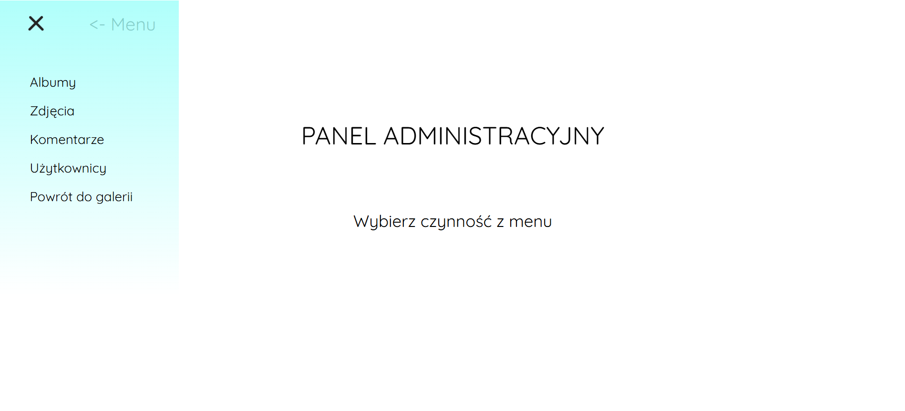

## Spis Treści

- [Spis Treści](#spis-treści)
- [Opis](#opis)
- [Funkcje](#funkcje)
- [Technologie](#technologie)
- [Wymagania](#wymagania)
- [Instalacja](#instalacja)
- [Użycie aplikacji](#użycie-aplikacji)
  - [Strona główna](#strona-główna)
  - [Logowanie i rejestracja](#logowanie-i-rejestracja)
  - [Panel użytkownika](#panel-użytkownika)
  - [Dodanie albumu i zdjęcia](#dodanie-albumu-i-zdjęcia)
  - [Wyświetlanie zdjęć](#wyświetlanie-zdjęć)
  - [Panel administratora](#panel-administratora)


---

## Opis

**ImageSpace** to aplikacji portalu galerii obrazów, która pozwala użytkownikom przesyłać, organizować i udostępniać obrazy. Została stworzona z myślą o potrzebie udostepniania i promowania twórczości fotografów, a także stworzenia wspólnej społeczności osób o tym samym zainteresowaniu. 

W dokumentacji opisano m.in.:
- Sposób instalacji i konfiguracji Docker
- Proces uruchomienia aplikacji i bazy danych w kontenerach
- Metody backupu i przywracania bazy danych
- Zrzuty ekranu przedstawiające interfejs użytkownika

---

## Funkcje

1. **Rejestracja i Logowanie**  
     Bezpieczny system autentykacji użytkowników (logowanie, rejestracja) wraz z przechowywaniem sesji uzytkownika.
2. **Zarządzanie Obrazami**  
   - Dodawanie, edycja, usuwanie zdjęć  
   - Tworzenie albumów
   - Zbuory najlepiej ocenianych i najnowszych zdjęć
3. **Uprawnienia Użytkowników**  
   - Role: Administrator, Moderator, Użytkownik  
   - Moderator może akceptować/odrzucać zdjęcia i komentarze
   - Administrator zarządza całym systemem , może usuwać, modyfikować albumy, usuwać lub zmieniać uprawnienia użytkowników, zarządzać zdjęciami oraz komentarzami
   - Role weryfikowane przez system w trakcie działania programu w kwestii dostepności niektórych opcji/zakładek zgodnie ze stanem.
4. **Komentarze i Oceny**  
   - Użytkownicy mogą komentować i oceniać dodane zdjęcia
5. **Responsywny UI**  
   - Dostosowany do urządzeń mobilnych i desktopowych

---

## Technologie

- **Backend**  
  - PHP 8 (OOP)  
  - PostgreSQL (baza danych)
- **Frontend**  
  - HTML5, CSS3, JavaScript
- **Inne**  
  - Docker & Docker Compose  
  - Git (do kontroli wersji)  

---

## Wymagania

1. **Docker**  
   - Zainstaluj [Docker](https://www.docker.com/get-started), aby móc uruchamiać kontenery.
2. **Docker Compose**  
   - Zainstaluj [Docker Compose](https://docs.docker.com/compose/install/) do zarządzania kilkoma usługami w jednym pliku.
3. **Git**  
   - Zainstaluj [Git](https://git-scm.com/), aby sklonować repozytorium.

---

## Instalacja

1. **Sklonowanie repozytorium**

   ```bash
   git clone https://github.com/TwojUzytkownik/ImageSpace.git

2. **Przejście do katalogu projektu**
    ```bash
    cd ImageSpace

## Konfiguracja

### Wymagania systemowe
- Zainstalowany Docker i Docker Compose.
- Zainstalowany klient do obsługi PostgreSQL (np. `psql`, DBeaver, DataGrip).

### Struktura kontenerów
Aplikacja korzysta z trzech kontenerów:
1. **`web`**: Serwer Nginx obsługujący żądania HTTP.
2. **`php`**: Kontener z interpreterem PHP 7.4 obsługującym logikę aplikacji.
3. **`db`**: Kontener PostgreSQL przechowujący dane aplikacji.

### Konfiguracja sieci
Kontenery są połączone w sieci `app-network`.  Nalezy upewnić się, że wszystkie kontenery są w tej samej sieci, aby mogły się komunikować.

### Przygotowanie plików konfiguracyjnych
Pliki konfiguracyjne są już zawarte w projekcie:
1. **`docker-compose.yml`**: Definiuje usługi i ich zależności.
2. **Pliki Dockerfile dla Nginx i PHP**: Określają środowisko uruchomieniowe dla serwera WWW i PHP.
3. **`nginx.conf`**: Plik konfiguracyjny serwera Nginx określający sposób obsługi żądań.

Nie należy ich edytować, chyba że istnieje potrzeba dostosowania środowiska.

### Przygotowanie bazy danych
1. **Utworzenie woluminu dla danych PostgreSQL**  
   Wolumin jest zdefiniowany w `docker-compose.yml` i zostanie automatycznie utworzony podczas uruchamiania kontenerów.

2. **Przywrócenie backup bazy danych**  
   W folderze projektu nalezy wykonać polecenie:
   ```bash
   docker exec -i <nazwa_kontenera_db> psql -U postgres postgres < ImageSpace_database.sql
3. **Sprawdzenie konfiguracji połączenia w aplikacji**  
   W pliku Database/DatabaseConnection.php nalezy upewnić się, że dane połączenia są zgodne z tymi w docker-compose.yml:
   - **Host**:db
   - **Użytkownik**:postgres
   - **Hasło**:root
   - **Nazwa bazy**:postgres
  

### Przygotowanie środowiska lokalnego
1. **Uruchomienie kontenerów**  
   W folderze projektu należy wykonać polecenie:
   ```bash
   docker-compose up --build
2. **Po uruchomieniu sprawdzić status kontenerów:**  
   W folderze projektu nalezy wykonać polecenie:
   ```bash
   docker ps

### Uwagi dotyczące konfiguracji
- Należy upewnić się, że katalogi z plikami mają odpowiednie uprawnienia do zapisu.
- W razie potrzeby dostososować porty w docker-compose.yml, jeśli porty 8080 i 5432 są zajęte.
- W przypadku chęci podłaczenia się do bazy danych za pomocą narzędzia GUI (np. DataGrip), należy użyć następujących danych:
    - Host: localhost
    - Port: 5432
    - Użytkownik: postgres
    - Hasło: root

## Uruchomienie aplikacji

### Uruchomienie kontenerów
1. Przejście do katalogu głównego projektu.
2. Wykonanie polecenia:
   ```bash
   docker-compose up --build
3. Kontenery zostaną uruchomione, a aplikacja będzie dostępna pod adresem: http://localhost:8080/CMS/index.php
   
## Struktura Projektu
```php
WDPAI/
│
├── CMS/                     # Katalog główny aplikacji
│   ├── classes/             # Klasy PHP używane w projekcie
│   │   ├── Renderers/       # Logika renderowania obiektów 
│   │   ├── Repositories/    # Logika dostępu do danych
│   │   ├── Services/        # Logika biznesowa
│   │   └── Database/ 
│   │── controllers/         # Kontorlery aplikacji, przekazywanie danych do widoków
│   │── javascript/          # skrypty javascript
│   │── photo/               # Katalog ze zdjęciami
│   │── style/               # Pliki CSS
│   ├── views/               # Widoki aplikacji
│   └── public               # Pliki publiczne
│
├── docker/                  # Pliki konfiguracji Dockera
│   ├── nginx/               # Pliki konfiguracyjne Nginx
│   │   ├── Dockerfile       # Dockerfile dla Nginx
│   │   └── nginx.conf       # Konfiguracja serwera Nginx
│   └── php/                 # Pliki konfiguracyjne PHP
│       └── Dockerfile       # Dockerfile dla PHP
│
├── scripts                  # Skrypty pomocnicze, np. backup bazy danych
├── docker-compose.yml       # Plik konfiguracji Docker Compose
└── README.md                # Dokumentacja projektu
   
```
## Użycie aplikacji

Poniżej przestawiony opis funkcjonalności aplikacji wraz z obrazami prezentującymi ich działanie.

### Strona główna
Po wejściu na stronę główną aplikacji wyświetla się lista dostępnych albumów. Każdy album zawiera miniaturkę oraz szczegóły, takie jak tytuł, autor i data utworzenia. Dostepne jest menu strony z zakładkami dla niezalogowanych użytkowników:  Najlepiej oceniane, Najnowsze, Zaloguj, Rejestracja. Dla zalogowanych użytkowników: Załóż album, Dodaj zdjęcie,Najlepiej oceniane, Najnowsze, Moje Konto i Wyloguj się.


---
### Logowanie i rejestracja
Każdy użytkownik musi się zarejestrować lub zalogować, aby korzystać z pełnej funkcjonalności aplikacji.


---
### Panel użytkownika
Po zalogowaniu się użytkownik ma dostęp do swojego panelu, w którym można:
- Zarządzać swoimi albumami.
- Edytować tytuły istniejących albumów i zdjęć.
- Zmieniać dane konta.


---

### Dodanie albumu i zdjęcia
Użytkownicy mogą:
- Tworzyć nowe albumy i dodawać zdjęcia do nich.


---

### Wyświetlanie zdjęć
Klikając na wybrany album, można zobaczyć listę zdjęć. Kliknięcie na zdjęcie otwiera jego szczegóły, w tym możliwość oceniania zdjęcia w skali od 1 do 10 i dodawania komentarzy.


---

### Panel administratora
Administratorzy mają dostęp do dodatkowych funkcji, takich jak:
- Zarządzanie użytkownikami.
- Akceptowanie lub usuwanie zdjęć i albumów.
- Zarządzanie komentarzami i ich akceptacja.





---

**Wykonał**: Andrzej Brzeziński


